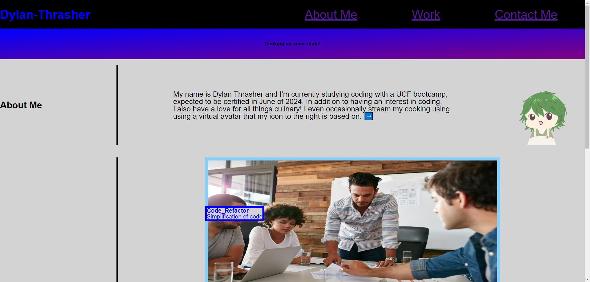

# Professional-Portfolio

## Description
This project was created in order to provide practice in making a professional portfolio to share with potential employers, complete with links to existing projects. 

## Usage
The header for this page features functional links to other sections of the page. The site features multiple sections to get to know both myself and my work. As the webpage was too large to screenshot completely in one image, there are two screenshots for both halves of the [finished page](https://dylan-thrasher.github.io/professional-portfolio/).

